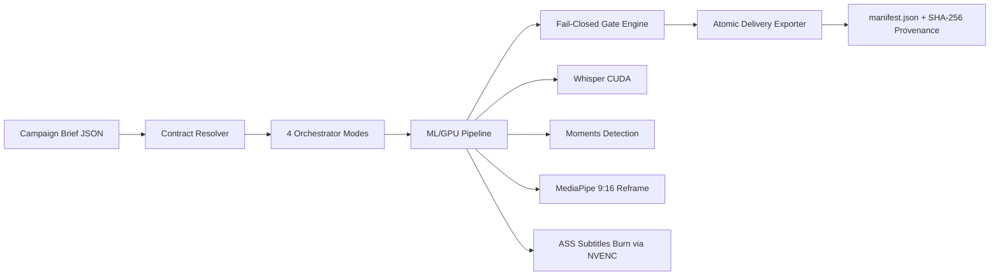

# Kliptych

**Deterministic, Fail-Closed Short-Form Video Production & Compliance Gate Engine**

[](https://github.com/KevinGracianoL/kliptych/actions)

[](https://github.com/KevinGracianoL/kliptych/releases/tag/v1.1.1)


Kliptych converts a chaotic campaign brief into a validated vertical-video delivery package through a
versioned JSON contract and a fail-closed compliance gate. The pipeline does the heavy lifting
(download, transcription, moment detection, 9:16 reframe, karaoke subtitles, hardware render);
publication stays manual — nothing ships without passing the gate or carrying an explicit,
attributed human approval sealed into the delivery record.

---

## Why Kliptych?

Content Rewards / UGC campaigns pay against contractual rules (mandatory mentions, exact brand
spelling, hashtags, duration bounds, audio requirements, watermark coverage). A false positive —
shipping a piece the rules actually reject — publishes non-monetized content or, worse, content
that draws a platform penalty. Human review does not scale to dozens of cuts; an LLM verdict does
not count as evidence.

Kliptych treats this as a controls problem and solves it with four engineering pillars:

### 1. Defense-in-Depth Fail-Closed Gate (`src/kliptych/gate/engine.py`, `src/kliptych/exporter.py`)

`_derive_status` maps **any** measured `CheckOutcome.FAIL` to `GateStatus.REJECTED` — regardless of
whether the rule was classified `hard`, `recommended`, or `manual_review`. A second barrier lives in
the exporter: `_is_piece_exportable` refuses every piece except `PASSED`, or `PENDING_REVIEW` with
explicit manual approval **and** zero `FAIL` checks. Batch export is all-or-nothing atomic
(staging directory + atomic rename in `_publish`); a rejected piece aborts the whole delivery, never
a partial shipment.

### 2. Cryptographic `--resume` State Machine (`src/kliptych/orchestrator.py`)

Every stage checkpoint carries SHA-256 signatures over its inputs: `source`, `audio_track` (local
bytes and remote URL + fingerprint), segment coordinates, model paths. On `--resume` each signature
is recomputed and compared; remote audio is revalidated, and any network failure during
revalidation fails closed instead of reusing a stale track. Corrupt artifacts (zero bytes,
truncated JSON, schema mismatch) invalidate exactly one stage for regeneration.

### 3. Human-in-the-Loop Audit Trail (`src/kliptych/exporter.py`, `src/kliptych/manifest.py`)

Rules with no mechanical validator (official-audio identity, full-video watermark, on-screen
product presence) resolve to `MANUAL_REVIEW`, never to a silent `PASS` — an LLM is not permitted to
clear a hard rule. Affected pieces pause at `PENDING_REVIEW` and export only with an explicit
operator signature:

```sh
--approve-manual-review --approved-by "<operator>"
```

Omitting `--approved-by` is a hard error (exit 1). Approval seals `manually_approved_rules`,
`approved_by`, and a UTC `approved_at_utc` timestamp into the delivery record next to
`brief_sha256` / `contract_sha256` provenance in `run_manifest.json`.

### 4. Constrained-VRAM GPU Orchestration — 4 GB GTX 1650 Ti

One GPU stage at a time, enforced by architecture, not discipline: `faster-whisper` (`small` and
`large-v3-turbo`, `int8` CUDA, in-memory model cache) transcribes, releases VRAM
(`cuda.empty_cache()`), then MediaPipe `FaceDetector` (`.tflite`, CPU delegate — zero VRAM
footprint) drives the 9:16 reframe, then FFmpeg `h264_nvenc` renders and burns ASS subtitles, with
automatic fallback to `libx264` when NVENC is absent. Windows hardening is load-bearing, not
cosmetic: CUDA 12 DLL directories (`nvidia/cublas/bin`, `nvidia/cudnn/bin`) are registered via
`os.add_dll_directory`, and the Hugging Face Hub symlink cache is patched to copy-fallback so model
download survives `WinError 1314` without Developer Mode.

---

## System Architecture



Pipeline order per piece: `yt-dlp`/`streamlink` acquisition → `faster-whisper` word-level
transcript → scene + audio-energy + chat-density moments → LLM segment selection → MediaPipe 9:16
reframe → `.ass` karaoke render → NVENC encode → gate over the finished artifact → atomic delivery.
The gate probes the rendered file with `ffprobe`, never the parameters that produced it. All
external invocations (`ffmpeg`, `ffprobe`, `yt-dlp`, `git`, `gh`) use argument lists; `shell=True`
with interpolation is banned repository-wide.

---

## Hardware Benchmarks — GTX 1650 Ti, 4,096 MiB VRAM

Measured host (`uv run kliptych env`): `NVIDIA GeForce GTX 1650 Ti`, `vram_mib: 4096`,
`nvenc_available: true`. Transcription in `int8` CUDA; reframe via MediaPipe CPU delegate;
render via `h264_nvenc`.

### Table A — CUDA Transcription Scaling

| Model | init (s) | 30s warm/cold (s) | 180s warm/cold (s) | Words (180s) | Marginal slope | Real-time factor | Peak VRAM |
|-------|----------|-------------------|---------------------|--------------|----------------|------------------|-----------|
| small | 2.0 | 2.47 / 2.81 | 11.82 / 12.08 | 569 | 0.062s/s | ~16x | 848 MiB (80% free) |
| large-v3-turbo | 4.4 | 3.86 / 3.99 | 18.01 / 18.06 | 561 | 0.094s/s | ~10.6x | 1,522 MiB (63% free) |

Both models stay well under the 4 GiB ceiling with headroom for the NVENC stage that follows.

### Table B — E2E Pipeline (3-min 1080p VOD → 4 Portrait 9:16 Clips)

| Stage | Time (s) | VRAM (MiB) | Encoder |
|-------|----------|------------|---------|
| Transcribe CUDA | 13.0 | 486→494 | CUDA |
| Moments | 5.5 | 494 | — |
| MediaPipe Reframe 9:16 (4 segs) | 17.4 | 593 | h264_nvenc |
| ASS Subtitles Burn NVENC (4 segs) | 4.4 | 593 | h264_nvenc |
| Gate + Export | <1 | — | — |

---

## Production Modes

`uv run kliptych campaign --mode <mode>` (default: `long_video`). The `run` subcommand serves the
`given_clips` fast path with recorded model replays.

| Mode | Trigger | What it does |
|------|---------|--------------|
| `long_video` | `--url <video>` | Full chain: download → CUDA transcript → moments → LLM cut selection → MediaPipe 9:16 reframe → ASS burn → NVENC render → gate. |
| `audio_locked` | `--audio-track-path <f>` xor `--audio-track-url <u>` | Injects a mandatory external track (exactly one source required); enforces audibility and duration match. Slideshows require this mode. |
| `repost_ugc` | (alias: `repost`) | Skips transcription and moment detection; reuses the approved clip. Lossless `-c copy` passthrough when the source is already 9:16, reframe otherwise; metadata normalized, caption rewritten. |
| `slideshow` | images + `audio_locked` | `concat`-demuxer assembly of `JPG`/`PNG` stills paced against the external audio; no transcription overhead. |

### Two-Step CLI Workflow (human approval gate)

Step 1 — the run pauses at `PENDING_REVIEW` and exits non-zero; nothing is exported:

```sh
uv run kliptych campaign campaigns/fixtures/long-video/brief.md \
  --out runs/demo-review \
  --mode long_video \
  --url "https://www.youtube.com/watch?v=<id>"
# exit code 1 — pieces awaiting manual review, delivery/ not written
```

Step 2 — the operator reviews the pending rules, then resumes with an attributed signature:

```sh
uv run kliptych campaign campaigns/fixtures/long-video/brief.md \
  --out runs/demo-review \
  --mode long_video \
  --url "https://www.youtube.com/watch?v=<id>" \
  --resume --approve-manual-review --approved-by "Kevin Graciano"
# exit code 0 — exports to runs/demo-review/delivery/
```

The delivery record seals the approval next to content provenance:

```json
{
  "manually_approved_rules": ["audio.official_selection", "watermark.full_video"],
  "approved_by": "Kevin Graciano",
  "approved_at_utc": "2026-09-25T02:14:00+00:00",
  "brief_sha256": "1ccafe8d5e0fcf45100e6eb947239742cd69b8cbb987640285ebaf738e622989"
}
```

(`manually_approved_rules`, `approved_by`, `approved_at_utc` are written by the exporter per piece;
`brief_sha256` and `contract_sha256` are sealed in `run_manifest.json` alongside gate results,
render arguments, model versions, and hardware/degradation info.)

---

## Quickstart

Requires Python 3.13+ and [`uv`](https://docs.astral.sh/uv/).

```sh
# Base install (deterministic, locked)
uv sync

# GPU extras: CUDA transcription (faster-whisper) + MediaPipe reframe
uv sync --extra transcription --extra reframe

# Verify toolchain, GPU, and NVENC in one shot
uv run kliptych env
```

### Windows GPU Provisioning

CUDA 12 ships as venv wheels (`nvidia-cublas-cu12`, `nvidia-cudnn-cu12`); at transcription start
Kliptych registers their `nvidia/cublas/bin` and `nvidia/cudnn/bin` directories with
`os.add_dll_directory` so `cublas`/`cudnn` resolve without a system CUDA install. Two environment
knobs:

```sh
$env:KLIPTYCH_WHISPER_MODEL = "small"          # or "large-v3-turbo"; int8 only
# Face model: MediaPipe .tflite bundle passed as PipelineConfig.face_model_path
# (bundled detector preset: blaze_face_short_range equivalent)
```

### Verify End-to-End

```sh
# 1. Environment + hardware report (ffmpeg, NVENC, VRAM)
uv run kliptych env

# 2. Ingest a brief to a versioned contract (offline, deterministic)
uv run kliptych ingest campaigns/fixtures/given-clips/brief.md

# 3. Full gate proof: accepted fixture exports, broken fixture is rejected
uv run kliptych run campaigns/fixtures/given-clips/brief.md \
  --out runs/demo-pass/package \
  --recorded campaigns/fixtures/given-clips/recorded

# 4. Quality gates — all four must pass before any PR
uv run ruff format --check .
uv run ruff check .
uv run basedpyright
uv run pytest
```

Accepted run prints `"outcome": "exported"` with the package path and manifest hash; a fixture
missing a mandatory mention (e.g. `@marca`) prints `"outcome": "blocked"` with
`"reason": "el gate no aprobó la pieza (rejected): caption.required_mention"` and exports nothing.
The important test is not that the gate passes a correct piece — it is that it rejects an
incorrect one, and CI carries intentionally broken fixtures (missing caption mark, missing hashtag,
out-of-range duration, wrong spelling, absent watermark, wrong audio, out-of-bounds segment) to
prove it on every push (Ubuntu + Windows).

---

## Project Status

Phases A–F implemented, each executable end-to-end (nothing counts as done from schema alone):

- [x] **A — Foundation & Gate Core**: contract schemas v1.1 with per-field evidence, fail-closed gate, asset registry with SHA-256, run manifests.
- [x] **B — Walking Skeleton (`given_clips`)**: headless brief → contract → assembly → caption → gate → atomic package, with rejection fixtures.
- [x] **C — Long-Video Engine**: bounded download, word-level Whisper (`small`, `large-v3-turbo`, `int8`), multimodal moments, LLM selection, MediaPipe CPU reframe, ASS subtitles, NVENC/CPU render with registered degradation.
- [x] **D — Special Modes**: `audio_locked`, `repost_ugc`, `slideshow`.
- [x] **E — Campaign Intelligence**: `KNOWN` / `KNOWN_WITH_VARIATION` / `NEW_ARCHETYPE` classifier with Zero Auto-Merge PR proposals — the model proposes, the owner merges.
- [x] **F — Operational Maturity**: structured CLI (`env`, `ingest`, `run`, `campaign`, `clean`), cryptographic `--resume` / `--restart`, TTL garbage collection.

`campaigns/private/` and `runs/` are git-ignored; CI fixtures are synthetic or anonymized. No
secrets, credentials, or personal data in commits or logs.

## License

Proprietary. All rights reserved. Author: Kevin Graciano.
