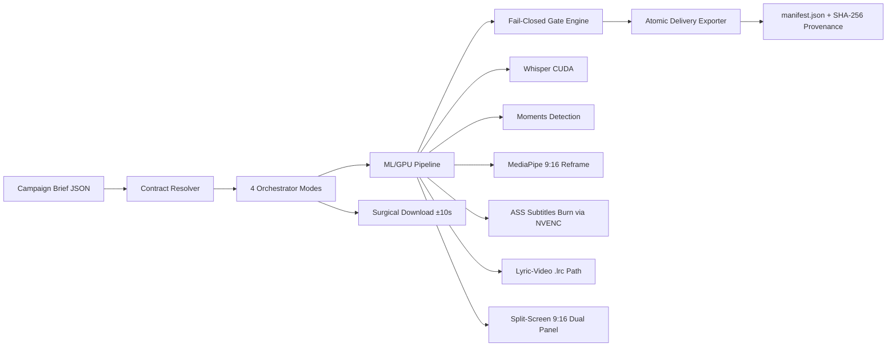

# Architecture — 4 Engineering Pillars

Kliptych treats short-form delivery as a controls problem: a chaotic campaign
brief becomes a versioned JSON contract, a GPU pipeline produces the clips,
and a fail-closed gate decides what ships. Publication stays manual — nothing
ships without passing the gate or carrying an explicit, attributed human
approval sealed into the delivery record.

## 1. Defense-in-Depth Fail-Closed Gate (`src/kliptych/gate/engine.py`, `src/kliptych/exporter.py`)

`_derive_status` maps **any** measured `CheckOutcome.FAIL` to
`GateStatus.REJECTED` — regardless of whether the rule was classified `hard`,
`recommended`, or `manual_review`. A second barrier lives in the exporter:
`_is_piece_exportable` refuses every piece except `PASSED`, or
`PENDING_REVIEW` with explicit manual approval **and** zero `FAIL` checks.
Batch export is all-or-nothing atomic (staging directory + atomic rename in
`_publish`); a rejected piece aborts the whole delivery, never a partial
shipment.

The validator catalog is mechanical and closed (`KNOWN_VALIDATOR_RULES`,
17 rule ids). Declared rules without a registered validator never pass
silently: they resolve to `MANUAL_REVIEW` when the contract classified them
so or cited them, otherwise `UNSUPPORTED` — and `UNSUPPORTED` on a `hard`
rule blocks the piece. Requirements with no mechanical validator at all are
declared explicitly as `contract.unmapped[]` (`rule` + verbatim `quote`); the
engine emits one aggregate `rules.unmapped` check carrying every citation,
`MANUAL_REVIEW` by default, `FAIL` when an unmapped id collides with a known
validator. Authorship decides the verdict where it matters:
`caption.forbidden` is `FAIL` when a prohibited term appears in
account-published text (caption, hashtags) and `MANUAL_REVIEW` when it
appears only in streamer-spoken `subtitle_text`.

## 2. Cryptographic `--resume` State Machine (`src/kliptych/orchestrator.py`)

Every stage checkpoint carries SHA-256 signatures over its inputs: `source`,
`audio_track` (local bytes and remote URL + fingerprint), segment
coordinates, model paths. On `--resume` each signature is recomputed and
compared; remote audio is revalidated, and any network failure during
revalidation fails closed instead of reusing a stale track. Corrupt artifacts
(zero bytes, truncated JSON, schema mismatch) invalidate exactly one stage
for regeneration.

The fingerprint covers every Sprint 2–3 input that changes the output: the
`audio_track` signature (path bytes or URL), the `watermark` block (position,
scale, opacity), `timestamp_ranges`, `lyric_video` config plus per-piece
lyric windows and `ass_path`, and `split_screen` config. Any change in these
inputs invalidates the cached stage. External audio injection is
exclusive-or: exactly one of `--audio-track-path` / `--audio-track-url` is
accepted, and `audio_locked` combined with `internal_official_sound` is
rejected at contract validation and in the orchestrator (contradiction
guard) — muting and injecting are opposites and never compose.

## 3. Human-in-the-Loop Audit Trail (`src/kliptych/exporter.py`, `src/kliptych/manifest.py`)

Rules with no mechanical validator (official-audio identity, full-video
watermark, on-screen product presence, unmapped brief requirements,
brand-safety risk) resolve to `MANUAL_REVIEW`, never to a silent `PASS` — an
LLM is not permitted to clear a hard rule. Affected pieces pause at
`PENDING_REVIEW` and export only with an explicit operator signature:

```sh
--approve-manual-review --approved-by "<operator>"
```

Omitting `--approved-by` is a hard error (exit 1). Approval seals
`manually_approved_rules`, `approved_by`, and a UTC `approved_at_utc`
timestamp into the delivery record next to `brief_sha256` /
`contract_sha256` provenance in `run_manifest.json`.

## 4. Constrained-VRAM GPU Orchestration — 4 GB GTX 1650 Ti

One GPU stage at a time, enforced by architecture, not discipline:
`faster-whisper` (`small` and `large-v3-turbo`, `int8` CUDA, in-memory model
cache, explicit `languages.language` locale with autodetect fallback)
transcribes, releases VRAM (`cuda.empty_cache()`), then MediaPipe
`FaceDetector` (`.tflite`, CPU delegate — zero VRAM footprint) drives the
9:16 reframe, then FFmpeg `h264_nvenc` renders and burns ASS subtitles, with
automatic fallback to `libx264` when NVENC is absent. Windows hardening is
load-bearing, not cosmetic: CUDA 12 DLL directories (`nvidia/cublas/bin`,
`nvidia/cudnn/bin`) are registered via `os.add_dll_directory`, and the
Hugging Face Hub symlink cache is patched to copy-fallback so model download
survives `WinError 1314` without Developer Mode. Watermark verification reads
the rendered file through a single `cv2.VideoCapture` pass (one open, one
seek per sample) instead of one ffmpeg process per frame.

## System Architecture



Pipeline order per piece: surgical `yt-dlp`/`streamlink` acquisition →
`faster-whisper` word-level transcript → scene + audio-energy + chat-density
moments → LLM segment selection → MediaPipe 9:16 reframe (or lyric-window /
split-screen composition) → `.ass` karaoke render → NVENC encode → gate over
the finished artifact → atomic delivery. The gate probes the rendered file
with `ffprobe`, `volumedetect`, and OpenCV — never the parameters that
produced it. All external invocations (`ffmpeg`, `ffprobe`, `yt-dlp`, `git`,
`gh`) use argument lists; `shell=True` with interpolation is banned
repository-wide.
